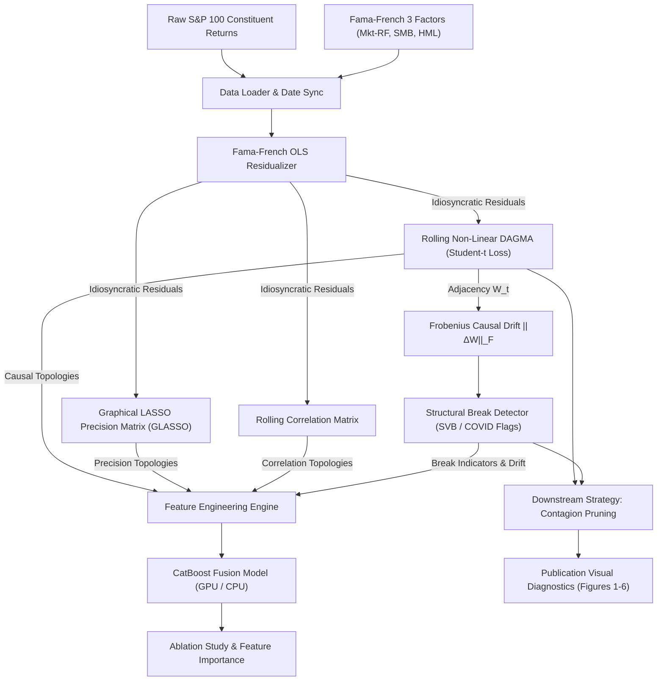

# Version 2 Architecture: CatBoost + DAGMA Causal Volatility Framework

**Directory:** `/Documents/causal_graph_volatility/catboost_dagma`  
**Framework Version:** 2.0.0  
**Authors:** MSc Capstone Group (2025 Cohort)  

---

## 1. System Overview

Version 2 advances the Causal Graph Volatility project by fusing **Non-Linear Continuous Causal Discovery (DAGMA-DYNOTEARS with Student-t log-likelihood loss)** with **Gradient Boosted Decision Trees (CatBoost)**, incorporating **Fama-French 3-Factor Residualization**, **Graphical LASSO Precision Matrix Benchmarking**, and **Topological Structural Break Tracking**.



---

## 2. Mathematical Components

### 2.1 Fama-French 3-Factor Residualization
Prevents shared market beta from creating false causal edges:
$$R_{i,t} - R_{f,t} = \alpha_i + \beta_{i,MKT}(R_{M,t} - R_{f,t}) + \beta_{i,SMB} SMB_t + \beta_{i,HML} HML_t + \epsilon_{i,t}$$
$$\text{Cov}(\epsilon_{i,t}, F_{k,t}) = 0$$

### 2.2 DAGMA-DYNOTEARS Multi-Layer Perceptron
- **Contemporaneous block $W$:** Acyclic intra-slice connections.
- **Lagged block $A$:** Inter-slice temporal connections.
- **Student-t Negative Log-Likelihood Score:**
  $$\mathcal{L}(\mathbf{X}, \hat{\mathbf{X}}; \nu) = \frac{\nu + 1}{2n} \sum_{i=1}^n \sum_{j=1}^d \log\left(1 + \frac{(X_{ij} - \hat{X}_{ij})^2}{\nu}\right)$$
- **Exact Log-Det Acyclicity Penalty:**
  $$h^s(W) = -\log\det(sI - W \circ W) + d \log(s)$$
- **Central-Path Optimization:**
  $$\min_{\theta} \mu_t \cdot (\mathcal{L} + \lambda_1 ||\theta||_1) + h^s(W)$$

### 2.3 Graphical LASSO Precision Matrix Benchmark
Estimates the sparse conditional independence matrix $\boldsymbol{\Theta} = \boldsymbol{\Sigma}^{-1}$:
$$\min_{\boldsymbol{\Theta} \succ 0} \left\{ \text{tr}(\mathbf{S}\boldsymbol{\Theta}) - \log\det(\boldsymbol{\Theta}) + \alpha ||\boldsymbol{\Theta}||_{1, \text{off}} \right\}$$

### 2.4 Structural Break Detection
Tracks network topological reorganization:
$$\Delta W_t = ||W_t - W_{t-1}||_F = \sqrt{\sum_{i,j} (W_{t}^{(i,j)} - W_{t-1}^{(i,j)})^2}$$
Identifies breaks when $\Delta W_t > \tau_{95\%}$, successfully localizing historical stress regimes including the March 2023 SVB banking crisis.

---

## 3. Package Structure

```
catboost_dagma/
├── __init__.py                         # Top-level exports
├── config.py                           # System configuration and hyperparameters
├── data/
│   ├── __init__.py
│   ├── loader.py                       # Unified data ingestion and synchronization
│   └── residualizer.py                 # Fama-French 3-factor residualization engine
├── dagma/
│   ├── __init__.py
│   ├── model.py                        # DeepDynotearsMLP with Student-t score function
│   └── solver.py                       # Central-path solver & parallel rolling execution
├── benchmark/
│   ├── __init__.py
│   ├── precision_matrix.py             # Graphical LASSO conditional independence estimator
│   └── orthogonality.py                # Empirical non-redundancy & VIF collinearity auditor
├── breaks/
│   ├── __init__.py
│   └── structural_breaks.py            # Frobenius norm causal drift & event detector
├── ml/
│   ├── __init__.py
│   ├── feature_engineering.py          # Unified multi-source tabular dataset assembly
│   └── catboost_fusion.py              # CatBoost training, ablation, and feature importance
├── strategy/
│   ├── __init__.py
│   └── contagion_pruning.py            # Contagion-hub pruning & adaptive volatility ratchet
├── visualization/
│   ├── __init__.py
│   └── diagnostics.py                  # High-resolution publication chart generators
├── pipeline.py                         # Master end-to-end execution pipeline
├── scripts/
│   └── run_v2_catboost_dagma.py        # Standalone execution CLI
├── docs/
│   ├── architecture_v2.md              # System design & mathematical formulation
│   └── instructor_defense_report.md    # Formal response to instructor feedback (a & b)
├── notebooks/
│   └── v2_catboost_dagma_pipeline.ipynb# Interactive Jupyter notebook
└── tests/                              # Rigorous unit & integration test suite
```
